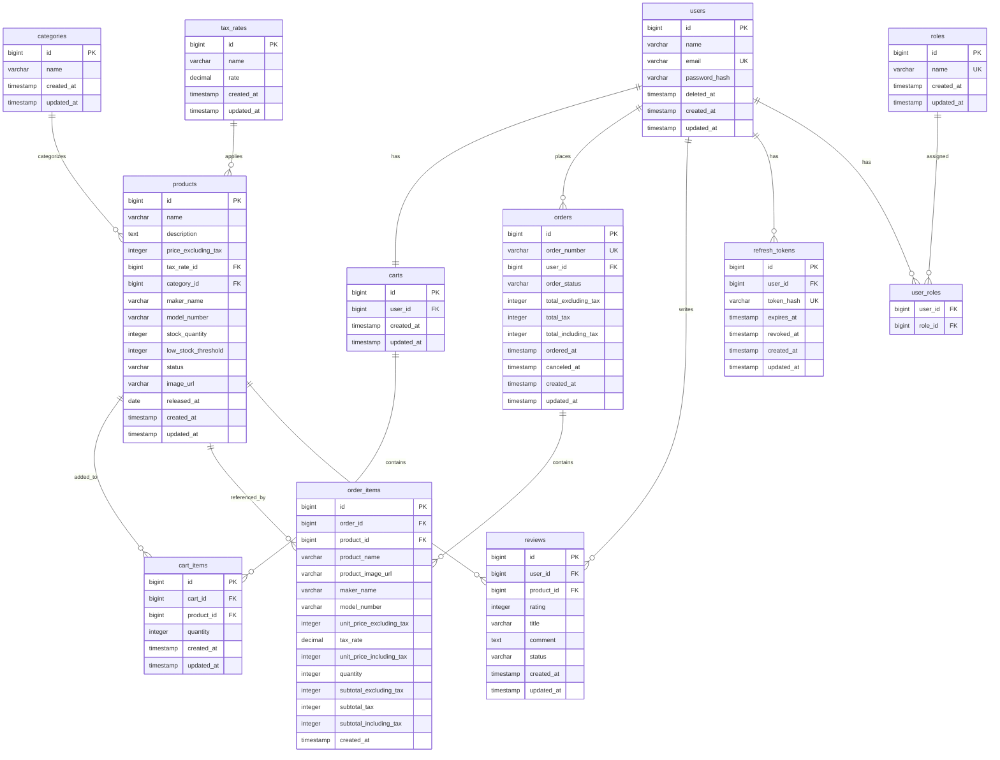

```mermaid
erDiagram
  users ||--|| carts : has
  users ||--o{ orders : places
  users ||--o{ reviews : writes
  users ||--o{ refresh_tokens : has
  users ||--o{ user_roles : has

  roles ||--o{ user_roles : assigned

  categories ||--o{ products : categorizes
  tax_rates ||--o{ products : applies

  products ||--o{ cart_items : added_to
  products ||--o{ order_items : referenced_by
  products ||--o{ reviews : receives

  carts ||--o{ cart_items : contains

  orders ||--o{ order_items : contains

  users {
    bigint id PK
    varchar name
    varchar email UK
    varchar password_hash
    timestamp deleted_at
    timestamp created_at
    timestamp updated_at
  }

  roles {
    bigint id PK
    varchar name UK
    timestamp created_at
    timestamp updated_at
  }

  user_roles {
    bigint user_id FK
    bigint role_id FK
  }

  refresh_tokens {
    bigint id PK
    bigint user_id FK
    varchar token_hash UK
    timestamp expires_at
    timestamp revoked_at
    timestamp created_at
    timestamp updated_at
  }

  categories {
    bigint id PK
    varchar name
    timestamp created_at
    timestamp updated_at
  }

  tax_rates {
    bigint id PK
    varchar name
    decimal rate
    timestamp created_at
    timestamp updated_at
  }

  products {
    bigint id PK
    varchar name
    text description
    integer price_excluding_tax
    bigint tax_rate_id FK
    bigint category_id FK
    varchar maker_name
    varchar model_number
    integer stock_quantity
    integer low_stock_threshold
    varchar status
    varchar image_url
    date released_at
    timestamp created_at
    timestamp updated_at
  }

  carts {
    bigint id PK
    bigint user_id FK
    timestamp created_at
    timestamp updated_at
  }

  cart_items {
    bigint id PK
    bigint cart_id FK
    bigint product_id FK
    integer quantity
    timestamp created_at
    timestamp updated_at
  }

  orders {
    bigint id PK
    varchar order_number UK
    bigint user_id FK
    varchar order_status
    integer total_excluding_tax
    integer total_tax
    integer total_including_tax
    timestamp ordered_at
    timestamp canceled_at
    timestamp created_at
    timestamp updated_at
  }

  order_items {
    bigint id PK
    bigint order_id FK
    bigint product_id FK
    varchar product_name
    varchar product_image_url
    varchar maker_name
    varchar model_number
    integer unit_price_excluding_tax
    decimal tax_rate
    integer unit_price_including_tax
    integer quantity
    integer subtotal_excluding_tax
    integer subtotal_tax
    integer subtotal_including_tax
    timestamp created_at
  }

  reviews {
    bigint id PK
    bigint user_id FK
    bigint product_id FK
    integer rating
    varchar title
    text comment
    varchar status
    timestamp created_at
    timestamp updated_at
  }
```